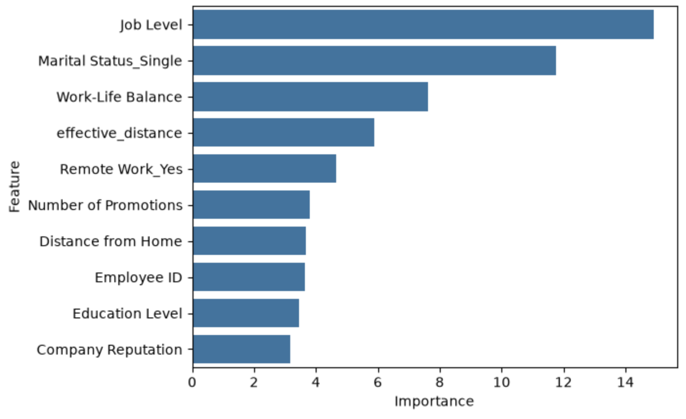
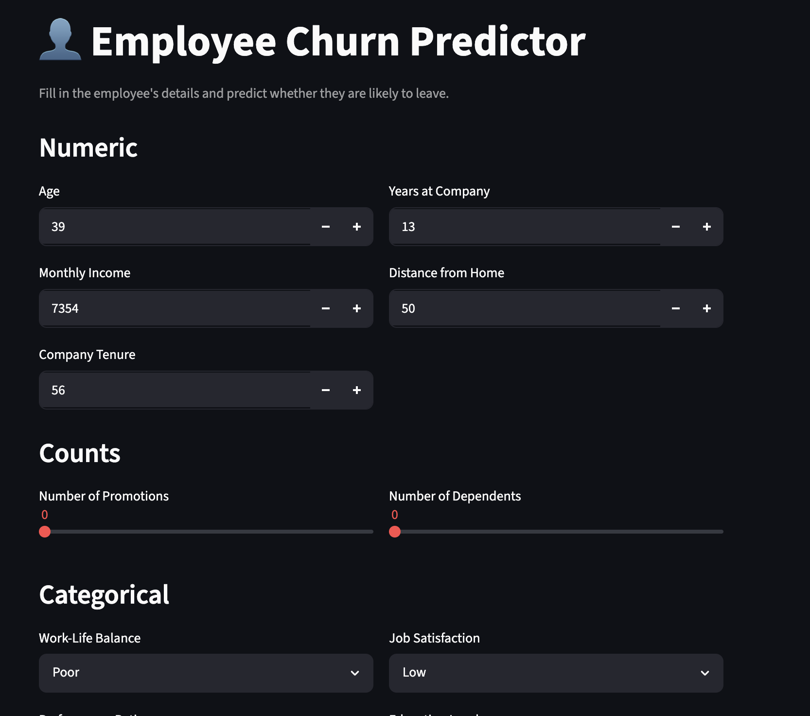

# 👤 Employee Churn Prediction

A machine-learning project that predicts whether an employee is likely to **leave** or **stay**, based on their job, compensation, and work-life attributes. It covers the full workflow — exploratory data analysis, feature engineering, model comparison, and a deployed **Streamlit** web app for live predictions.

## 🔗 Live Demo

> **[👉 Try the app here](https://churn.krrish.dev)**  *(If not working, kindly contact me, I will fix it in a jiffy)*

---

## 📌 Problem Statement

Employee attrition is expensive — losing staff means re-hiring, re-training, and lost productivity. This is a **binary classification** problem:

- **`0` → Stayed**
- **`1` → Left**

Given 23 attributes about an employee, the model outputs the **probability** that they will churn.

---

## 📊 Dataset

| | |
|---|---|
| **Train rows** | 59,598 |
| **Test rows**  | 14,900 |
| **Features**   | 23 (after dropping `Employee ID`) |
| **Target**     | `Attrition` — `Stayed` / `Left` |
| **Class balance** | 52.4% Stayed · 47.5% Left (well balanced) |
| **Missing / duplicate values** | None |

**Feature types**

- **Numerical (7):** Age, Years at Company, Monthly Income, Number of Promotions, Distance from Home, Number of Dependents, Company Tenure
- **Ordinal categorical (8):** Work-Life Balance, Job Satisfaction, Performance Rating, Education Level, Job Level, Company Size, Company Reputation, Employee Recognition
- **Nominal categorical (7):** Gender, Job Role, Overtime, Marital Status, Remote Work, Leadership Opportunities, Innovation Opportunities

---

## 🔍 Exploratory Data Analysis

The complete EDA is in [`notebook.ipynb`](notebook.ipynb). Highlights:

- **Target is balanced** — no resampling needed, accuracy is a meaningful metric.
- **Univariate analysis** — KDE/histograms for numeric columns, count plots for categorical columns. Most numeric features are reasonably distributed; `Company Tenure` is skewed and was left as-is after transforms didn't help.
- **Bivariate analysis** — box plots (numeric vs. attrition) and per-category churn-rate bar plots to find which groups churn most.
- **Multicollinearity** — correlation heatmap showed no strong collinearity between numeric features.
- **Outliers** — IQR check found minor outliers only in `Years at Company` (273) and `Monthly Income` (50); kept since CatBoost is robust to them.

---

## 🛠️ Feature Engineering

Five domain-driven features were added (see [`src/preprocessing.py`](src/preprocessing.py)):

| Feature | Meaning |
|---|---|
| `promotions_per_year` | Career stagnation signal |
| `tenure_ratio` | Share of career spent at this company (loyalty) |
| `age_at_joining` | Joined young vs. late-career |
| `income_per_dependent` | Financial pressure |
| `effective_distance` | Commute distance, zeroed out for remote workers |

---

## 🤖 Modeling

Several models were compared with 5-fold cross-validation (accuracy & F1):

- Logistic Regression
- Decision Tree
- Random Forest
- XGBoost
- **CatBoost ✅ (best)**
- Soft-voting ensemble (CatBoost + XGBoost + RF)

**CatBoost** gave the best, most stable performance and handles categorical features natively.

The final model is a single scikit-learn **`Pipeline`**:

```
feature_engineering → ColumnTransformer (ordinal + one-hot encoding) → CatBoostClassifier
```

This keeps preprocessing and the model together, so raw employee data can be passed straight in for prediction. The trained pipeline is saved to [`model/model.pkl`](model/model.pkl).

### 📈 Results (held-out test set)

| Metric | Score |
|---|---|
| Accuracy | **0.76** |
| ROC-AUC  | **0.85** |
| Precision (Left) | 0.75 |
| Recall (Left)    | 0.75 |
| F1 (Left)        | 0.75 |

Train accuracy 0.81 vs. test 0.76 → minimal overfitting.

### 🏆 Top Predictors of Churn

1. Job Level
2. Marital Status (Single)
3. Work-Life Balance
4. Remote Work
5. Distance from Home / Effective Distance
6. Number of Promotions

---

## 📁 Project Structure

```
Employee_Churn/
├── app.py                 # Streamlit web app (interactive predictions)
├── predict.py             # Minimal scripted prediction example
├── notebook.ipynb         # Full EDA, feature engineering & model training
├── src/
│   └── preprocessing.py   # feature_engineer() used inside the pipeline
├── model/
│   └── model.pkl          # Trained CatBoost pipeline
├── data/
│   ├── train.csv
│   └── test.csv
├── requirements.txt
└── README.md
```

---

## 🚀 Getting Started

### 1. Clone & set up the environment

```bash
git clone <your-repo-url>
cd Employee_Churn

python -m venv .venv
source .venv/bin/activate        # Windows: .venv\Scripts\activate

pip install -r requirements.txt
```

### 2. Run the web app

```bash
streamlit run app.py
```

Fill in the employee's details and click **Predict** to see the churn probability.

### 3. Predict from a script

```bash
python predict.py
```

Edit the `sample_input` dictionary in [`predict.py`](predict.py) to try different employees.

---

## 🧰 Tech Stack

Python · pandas · NumPy · scikit-learn · CatBoost · XGBoost · Matplotlib · Seaborn · Streamlit

---

## 📷 Screenshots




